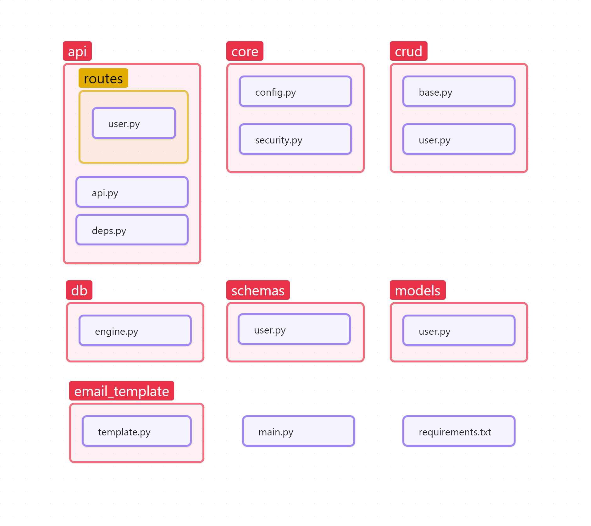

# FastAPI 프로젝트 구조

여기에서는 전체적인 프로젝트 디렉토리 구조에 관해 설명하겠습니다. API 별로 파일 구성하는 것 대신, 영역별로 구조화하여 추후 기능이 추가되더라도 전체적인 파일 구조는 최소한의 변화가 있도록 하였습니다. 이 부분은 각각 장단점이 존재하니 각자의 서비스 특성에 맞게 수정할 수 있습니다.

- api

  - API 생성을 위한 코드 집합이며 routes 안에 있는 코드들이 주요 API 동작을 관리하게 됩니다.

  - api.py에서는 APIRouter를 통해 routes를 관리합니다.
  - deps.py를 통해 인증 토큰 생성, DB 접속 등을 통제합니다.

- core
  - config.py 를 통해 프로젝트 구성 내용을 관리합니다.

- crud
  - 데이터의 CRUD와 관련된 코드들을 관리합니다.

- db
  - DB(Postgresql) 접속 Session 생성하는 역할을 수행합니다.

- email_template
  - 이메일 전송 양식들을 Class 내 HTML 형식 String으로 관리합니다.

- models
  - 모델의 Output Schema 관리합니다.

- schemas
  - 모델의 Input Schema 관리합니다.

- main.py
  - 프로젝트에서 활용하게 될 App을 정의하는 중요한 부분입니다.
  - app, middleware, api 정의하고 실행합니다.

- requirements.txt
  - 프로젝트 필요 패키지 목록 및 버전을 관리합니다.