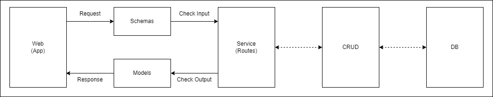

# 6. API 만들기

여기에서는 API의 Dataflow 및 각 과정에서 API를 만들기 위해 필요한 것들을 설명하겠습니다. 일반적인 API의 데이터의 입력부터 출력까지의 과정이 기준이며, 기능에 따라 특정 과정은 실제로는 없을 수도 있습니다.



* Schemas

  앞으로 입력 데이터의 형태는 schemas 내 파일에서 관리할 것입니다.

  입력 데이터의 변수별로 알맞은 type을 지정해 주어야 합니다. 이 부분은 Pydantic의 데이터 유효성 검사 기능을 활용하였으며, 추후에도 계속해서 사용할 것입니다.

  ``````python {filename="/schemas/user.py"}
  import datetime
  from typing import Optional
  from pydantic import BaseModel, EmailStr
  
  class CreateUserForm(BaseModel):
      nickname: str
      password1: str
      password2: str
      email: EmailStr
      birth: Optional[datetime.datetime] = None
      gender: Optional[str] = None
      region: Optional[str] = None
      profile_image: Optional[str] = None
  ``````
  
  예시에서는 회원가입시에 필요한 입력 변수에 대해 정의했습니다. 입력 데이터의 형식이 미리 정의한 것과 다를 경우 검증 과정에서 에러가 발생합니다.
  
  
  
* Service(Routes)

  실제로 API의 기능을 정의하는 부분이며 이전에 언급했듯이 Restful 지식이 필요한 부분입니다.

  router decorator를 사용하여 post, get, put, delete, patch 중 하나의 method를 지정하며 이때 URI, 성공 시 status(status_code), output form(response_model), description 등을 정의할 수 있습니다.

  ``````python {filename="/api/routes/user.py"}
  from starlette import status
  from fastapi import APIRouter, HTTPException
  
  from api.deps import SessionDep
  from schemas.user import CreateUserForm
  from crud.user import create_user, get_existing_user, get_existing_nickname
  from models.user import User
  
  router = APIRouter()
  
  @router.post("/create_user",
               status_code=status.HTTP_201_CREATED,
               response_model=User,
               description="회원가입 api")
  async def user_create(session: SessionDep, create_user_form: CreateUserForm):
      user = get_existing_user(session, user_create=create_user_form)
      if user:
          raise HTTPException(status_code=status.HTTP_409_CONFLICT,
                              detail="이미 존재하는 사용자입니다.")
  
      nickname = get_existing_nickname(session, user_create=create_user_form)
      if nickname:
          raise HTTPException(status_code=status.HTTP_409_CONFLICT,
                              detail="이미 존재하는 닉네임입니다.")
  
      db_user = create_user(db=session, user_create=create_user_form)
  
      return db_user
  ``````

  예시에서는 회원가입 시에 필요한 변수를 입력받고, 이미 존재하는 고객인지 확인 후 닉네임 검증 과정을 거쳐 고객 정보를 DB에 등록하는 기능을 수행하는 API를 구현하였습니다.
  
  

* Models

  출력 데이터 형태는 models 내 파일에서 관리할 것입니다.
  
  입력 데이터와 마찬가지로 출력 데이터의 각 변수별로 알맞은 type을 지정해주어야 합니다.
  
  (참고) SQLModel의 경우 table이라는 변수를 받아서 SQLAlchemy model 인지 Pydantic model 인지 구분합니다. True일 경우 SQLAlchemy model, False일 경우 Pydnatic model이 됩니다.
  
  ``````python {filename="/models/user.py"}
  from datetime import date
  from typing import Optional
  from sqlmodel import SQLModel, Field
  
  class UserBase(SQLModel, table=False):
      nickname: str
      region: str
      profile_image: str
      
  class User(UserBase, table=True):
      __tablename__ = 'user'
      __table_args__ = {'schema': 'dbname'}
      user_id: Optional[int] = Field(default=None, primary_key=True)
      nickname: str
      password: str
      email: str
      birth: Optional[date] = None
      gender: Optional[str] = None
      region: Optional[str] = None
      profile_image: Optional[str] = None
  ``````
  
  예시에서는 고객 정보의 출력 변수에 대해 정의했습니다. 출력 데이터의 형식이 미리 정의한 것과 다를 경우 검증 과정에서 에러가 발생합니다.
  
  


* CRUD (optional)

  DB에 CRUD의 기능을 활용해야 할 때 작동하며, 필요한 경우 schemas에서 Input 정보를, models에서 output 정보를 받아 수행합니다.

  이때 sqlalchemy.orm Session을 통해 db와 연동합니다.

  ``````python {filename="/crud/user.py"}
  from schemas.user import CreateUserForm
  from models.user import User
  
  from passlib.context import CryptContext
  from sqlalchemy.orm import Session
  
  def get_existing_user(db: Session, user_create: CreateUserForm):
      return db.query(User).filter(
          (User.email == user_create.email)
      ).first()
  ``````
  
  예시에서는 고객 정보의 출력 변수에 대해 정의했습니다. 출력 데이터의 형식이 미리 정의한 것과 다를 경우 검증 과정에서 에러가 발생합니다.

  

**FastAPI 서버 실행 방법**

파이참 등 터미널 실행하여 main.py 파일이 존재하는 디렉토리로 이동 후 `uvicorn main:app --reload` 명령어 실행하면 됩니다.

```
uvicorn main:app --reload
```

주소 뒤에 /docs 추가할 경우 swagger(대화형 API) 접속 가능하며 이를 통해 여러 테스트를 진행할 수 있습니다.